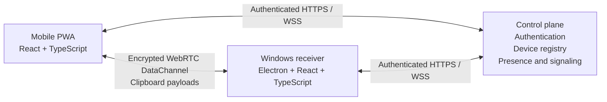

# Copyrade

**Private, direct clipboard continuity from mobile devices to Windows.**

Copyrade is a mobile-to-Windows clipboard application designed to make moving text and images between personal devices fast and effortless. Copy content on a phone, send it to a registered computer, and paste it immediately in Windows—without using email, messaging apps, or cloud clipboard storage.

> **Status:** Early development. The mobile clipboard capability prototype is complete; peer-to-peer transfer and the Windows receiver are the next major milestones.

## How it will work

1. Copy text or an image on a mobile device.
2. Open the Copyrade PWA and choose a registered Windows computer.
3. Send the clipboard through a direct WebRTC connection.
4. Paste it immediately in Windows with `Ctrl+V`.

The sender receives confirmation after the Windows application successfully updates the native clipboard.

## Why Copyrade?

Moving small pieces of content between mobile devices and Windows often involves an unnecessary intermediate step: sending a message to yourself, uploading a file, or relying on a cloud clipboard history.

Copyrade is designed around a simpler model:

- **Clipboard-first:** received content is written directly to the Windows clipboard.
- **Peer-to-peer:** clipboard payloads travel between devices through WebRTC whenever a direct connection is available.
- **Private by design:** Copyrade infrastructure coordinates devices without storing clipboard contents.
- **Cross-network:** devices connect through authenticated signaling instead of relying on local-network discovery.
- **Extensible:** the protocol is designed to support multiple clipboard representations, beginning with plain text and PNG images.

## Development status

| Component | Status |
|---|---|
| React + TypeScript mobile interface | In progress |
| Plain-text clipboard capability prototype | Complete |
| Real-device iPhone compatibility testing | Next |
| Electron Windows clipboard receiver | Planned |
| WebRTC text transfer and delivery acknowledgement | Planned |
| Accounts and registered-device discovery | Planned |
| Chunked image transfer | Planned |
| Windows packaging and public alpha | Planned |

The current mobile prototype includes:

- user-initiated clipboard reading;
- secure-context and browser-capability detection;
- loading, success, empty, and error states;
- an in-memory clipboard preview and clear action;
- responsive, keyboard-accessible UI;
- ESLint and TypeScript validation with a reproducible Vite build.

## Architecture

Copyrade separates device coordination from clipboard delivery. The backend acts as a control plane for accounts, registered devices, presence, and WebRTC signaling. Clipboard payloads use a separate peer-to-peer data plane.



### Privacy model

Copyrade is being designed so that its backend handles only the metadata required to authenticate users, discover their devices, report presence, and establish peer connections. Clipboard contents are not intended to be stored, queued, or added to a cloud history.

The Windows application will isolate privileged clipboard access inside Electron's main process and expose only a narrow, validated interface to the renderer. Transfer acknowledgements will represent a successful native clipboard write—not merely receipt of a network message.

## Technology

| Area | Technology |
|---|---|
| Mobile client | React, TypeScript, Vite, PWA |
| Windows client | Electron, React, TypeScript |
| Peer-to-peer transport | WebRTC DataChannel |
| Device coordination | Authenticated WebSocket signaling |
| Shared protocol | Versioned, runtime-validated TypeScript messages |
| Planned hosting | Cloudflare Pages, Workers, Durable Objects, and D1 |
| Distribution | GitHub Releases |

The desktop, signaling, protocol, and hosting choices will be validated through working prototypes before the public alpha.

## Repository structure

```text
copyrade/
|-- apps/
|   `-- mobile/          # Current React + TypeScript mobile client
|-- .gitignore
`-- README.md
```

The repository will expand to include the Electron receiver, signaling service, shared protocol package, and architecture/security documentation as those components are implemented.

## Getting started

### Requirements

- Node.js and npm
- A modern browser with Clipboard API support

The current prototype has been tested with Node.js `24.20.0` and npm `11.19.0`.

### Run the mobile client

```bash
cd apps/mobile
npm ci
npm run dev
```

Open the local address printed by Vite, copy some text, and select **Read clipboard**.

### Validate a change

```bash
cd apps/mobile
npm run lint
npm run build
```

## Roadmap

1. Validate clipboard text and image behavior on a real iPhone.
2. Build a securely isolated Electron clipboard receiver.
3. Establish direct WebRTC text transfer with delivery acknowledgements.
4. Add accounts, device registration, presence, and authenticated signaling.
5. Add bounded, chunked PNG transfer with backpressure and reassembly.
6. Harden reconnection, tray operation, validation, packaging, and compatibility.
7. Publish the first documented Windows alpha.

## Contributing

Copyrade is currently under active foundational development. Bug reports and technical feedback are welcome through GitHub Issues. Contribution guidance will be added once the initial architecture and development workflow have stabilized.

## License

No open-source license has been selected yet.
