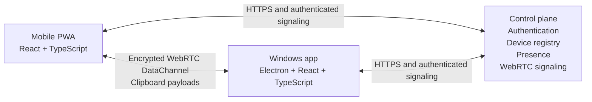

# Copyrade

> Your clipboard comrade.

Copyrade is a privacy-focused mobile-to-Windows clipboard continuity application. Its goal is to let someone deliberately send clipboard content from an iPhone or other mobile browser directly to the native Windows clipboard, making the content immediately available to paste on the PC.

Copyrade is currently in early development. The first mobile clipboard capability test is working; device-to-device transfer is not implemented yet.

## Current status

The repository currently contains a React and TypeScript mobile web application with:

- a user-initiated **Read clipboard** action;
- secure-context and browser-capability checks;
- clear loading, success, and error states;
- an in-memory text preview with a clear action;
- no clipboard-content logging, uploading, or persistence;
- responsive and accessible mobile-oriented UI;
- passing ESLint, TypeScript, and Vite production builds.

### Current milestone: mobile clipboard capability test

- [x] Create the React + TypeScript mobile application
- [x] Read plain text through the browser Clipboard API
- [x] Handle unsupported, insecure, and permission-denied cases
- [x] Keep clipboard contents in page memory only
- [ ] Test clipboard behavior in iPhone Safari over HTTPS
- [ ] Record installed-PWA versus Safari-tab behavior

## Intended experience

```text
Copy content on iPhone
        ↓
Open Copyrade and choose a Windows device
        ↓
Send Clipboard
        ↓
Windows writes the received content to its native clipboard
        ↓
Press Ctrl+V
```

The sender should report success only after the Windows application confirms that the native clipboard write succeeded.

## Planned architecture



Copyrade separates its infrastructure into two paths:

- **Control plane:** authentication, registered devices, presence, and WebRTC signaling.
- **Data plane:** clipboard payloads sent directly between devices through an encrypted WebRTC DataChannel whenever a direct connection is possible.

The planned backend does not store clipboard contents or provide cloud clipboard history. Initial releases will use direct connectivity with STUN and display a clear failure if the network requires a relay. TURN fallback is a future reliability decision.

## Privacy and security principles

- Clipboard contents must not be stored by the backend.
- Clipboard contents must not appear in application logs, analytics, URLs, or signaling messages.
- Clipboard data should remain in memory only for the active operation or transfer.
- WebRTC encryption is not treated as device authentication; authenticated device trust will be implemented separately.
- Incoming messages must be validated before reaching privileged desktop operations.
- Electron renderers will not receive unrestricted Node.js or operating-system access.
- A delivery acknowledgement will be sent only after a successful Windows clipboard write.

These are architectural requirements. Features that depend on the future desktop, signaling, and account implementations are not yet complete.

## Technology direction

| Area | Technology |
|---|---|
| Mobile sender | React, TypeScript, Vite, PWA |
| Windows receiver | Electron, React, TypeScript |
| Clipboard transport | WebRTC DataChannel |
| Signaling | Authenticated WebSocket connection |
| Shared messages | Versioned, runtime-validated TypeScript protocol |
| Planned hosting | Cloudflare Pages, Workers, Durable Objects, and D1 |
| Source and Windows releases | GitHub and GitHub Releases |

Technology choices beyond the existing mobile application remain provisional until the relevant capability tests are completed.

## Repository structure

```text
copyrade/
├── apps/
│   └── mobile/          # Current React + TypeScript clipboard test
├── README.md
└── .gitignore
```

Planned additions:

```text
apps/desktop/            # Electron Windows receiver
apps/signaling/          # Authentication, presence, and WebRTC signaling
packages/protocol/       # Shared validated message definitions
docs/                    # Architecture, protocol, security, and compatibility
```

## Run the current mobile application

### Prerequisites

- A recent Node.js and npm installation
- A browser with Clipboard API support

The current project has been tested with Node.js `24.20.0` and npm `11.19.0`.

### Install and start

```bash
cd apps/mobile
npm ci
npm run dev
```

Open the localhost address printed by Vite. Copy some text, select **Read clipboard**, and approve any browser-controlled paste prompt.

Clipboard reads require a secure context. `localhost` is accepted for local development; testing on an iPhone will require an HTTPS deployment.

### Quality checks

```bash
cd apps/mobile
npm run lint
npm run build
```

## Roadmap

### 1. Capability verification

- Test text clipboard access on a real iPhone
- Investigate image clipboard representations and MIME types
- Verify Electron can write to the Windows clipboard through secure IPC

### 2. Text transfer proof

- Add the Electron receiver
- Add minimal signaling
- Establish an iPhone-to-Electron WebRTC DataChannel
- Transfer plain text to the Windows clipboard
- Return an acknowledgement after the clipboard write

### 3. Product-shaped alpha

- Add accounts and same-account device discovery
- Authenticate device sessions and signaling actions
- Add device presence, persistence, reconnection, and revocation
- Add PNG-oriented image transfer with chunking and backpressure
- Add tray operation, packaging, compatibility tests, and security hardening

## Known limitations

- No mobile-to-Windows transfer exists yet.
- No Electron application or signaling backend exists yet.
- Accounts, device registration, and authenticated sessions are not implemented.
- Only user-initiated plain-text clipboard reads are currently tested in the mobile UI.
- iPhone Safari and installed-PWA behavior still require real-device testing.
- Image transfer, chunking, reconnect behavior, and Windows packaging are planned work.

## Project goals

Copyrade is being developed as a substantial personal software-engineering project. The project emphasizes explainable architecture, small verified milestones, accurate documentation, privacy-aware design, and learning React, TypeScript, Electron, and real-time networking through implementation.

## License

A project license has not been selected yet.
