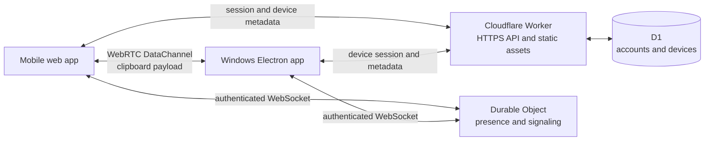

# Production architecture

Copyrade uses Cloudflare for its public web application and control plane while
keeping clipboard payloads on an encrypted WebRTC DataChannel between a user's
devices.

## Selected services

- **Workers Static Assets** serves the React mobile build from the same stable
  HTTPS origin as the API. A single origin avoids unnecessary CORS and cookie
  complexity.
- **Cloudflare Worker** hosts account, session, device, and authorization APIs.
- **D1** stores durable account, linked identity, session, registered-device,
  and revocation records. It never stores clipboard payloads.
- **Durable Objects** coordinate per-account device presence and transient
  WebRTC signaling over hibernating WebSockets. SDP and ICE data live only long
  enough to establish a connection.
- **WebRTC DataChannel** carries text and image payloads directly between the
  mobile sender and Windows receiver.
- **GitHub Releases** will distribute signed Windows builds when packaging is
  ready. GitHub remains the source and review platform, not the runtime host.

The first environment is a stable `copyrade-staging` Worker. A custom domain
can be added after the authentication and device-authorization flow is tested.

## Identity model

Every person has one immutable internal user ID. Login methods are separate
provider accounts linked to that user:

- Google OAuth;
- GitHub OAuth;
- verified email plus password, when direct credentials are added later.

Automatic linking is allowed only when a provider returns the same verified
email address. A matching unverified email, username, display name, or similar
address is insufficient. A signed-in user may explicitly link another provider.
The last login method cannot be removed until another usable method exists.

## Device authorization

The Windows app will use an OAuth-style device authorization flow:

1. Electron requests a short-lived device code and displays a short user code
   and QR link.
2. The user signs in on the mobile web app and approves the named Windows
   device.
3. Electron polls until approval, then receives a revocable device session.
4. Electron protects that session with `safeStorage` (Windows DPAPI).
5. Routine transfers show the user's registered online devices; the pairing
   code is not re-entered for each connection.

Codes will be single-use, expire quickly, be rate-limited, and never appear in
logs. Device names are user-editable metadata, not proof of identity.

## Delivery stages

1. Deploy the Worker/static-assets foundation and create staging D1.
2. Add Better Auth with Google and GitHub, migrations, session tests, and strict
   verified-email linking.
3. Add device authorization, encrypted desktop session storage, and revocation.
4. Replace the development room with authenticated Durable Object signaling.
5. Add reconnect/presence behavior and decide whether TURN is required from
   compatibility evidence.

Each stage remains separately testable and reviewable. The local unauthenticated
signaling spike stays available for synthetic protocol development until the
authenticated replacement is proven.
